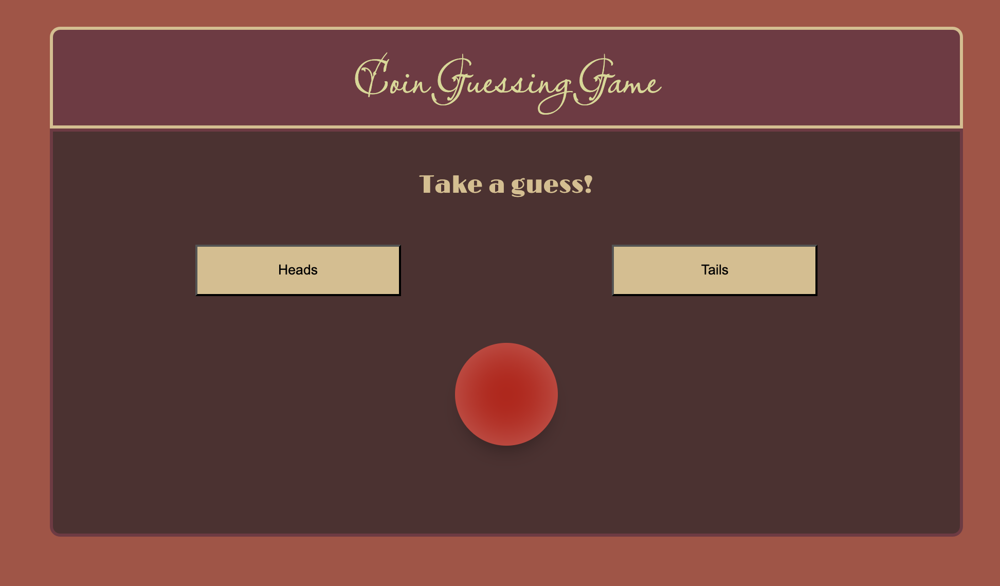

# Node Coin-Flip

_This is an app made with Node that sends a request to a server to flip a coin._

<a href="https://node-coin-flip-bootcamp-oyim.onrender.com/">Here is the rendered project</a>

 

## How It's Made:
_Tech used: HTML, CSS, JavaScript, Node.js_

I used Node to practice building a back-end server and make requests to an API. When the user presses a button, the request is made to the server. It decides the outcome and sends the result back client-side. A little animation is played, credit to <a href="https://codepen.io/seligmar/pen/RwPNQOd">Mary Selig</a>, to represent the result, and the Dom is updated to tell the user if they got it right or not.

## Lessons Learned:
This was my first stint into Node, so there was a lot to gain and learn from this project. A few things of note were:
<ul>
<li> Setting up the server/index.js to handle all of the files needed for the webpage</li>
<li> Learning how to make functions in the server</li>
<li> Not really a lesson, but more of a reminder to have an organized and repeatable file structure, makes life a whole lot easier</li>
</ul>

### More Projects:
<a href="https://github.com/godwinKamau/wu-tang-generator-bootcamp">Wu-Tang Name Generator</a>
<a href="https://github.com/godwinKamau/complex-api">Using APIs to expand my music tastes</a>
